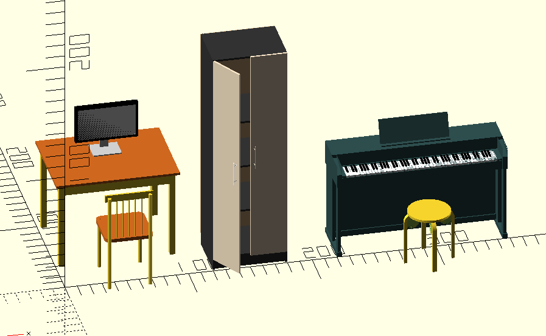
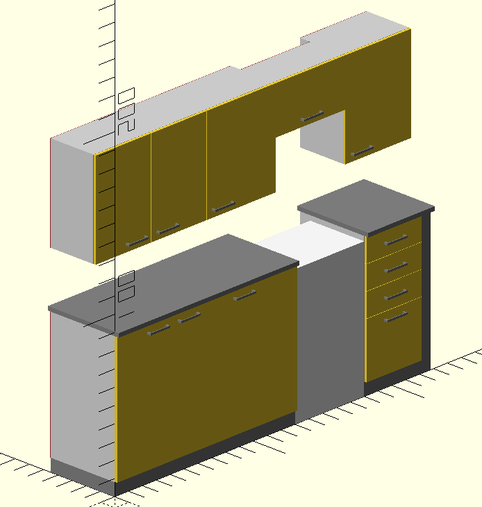

Библиотека мебели в формате OpenSCAD
====================================

У всех объектов можно изменять габаритные параметры и они будут оптимально перерисовываться вместо обычного растягивания до нужных величин.

* [Ссылка на редактор](http://www.openscad.org)
* [Документация на русском](https://ru.wikibooks.org/wiki/Руководство_пользователя_по_OpenSCAD/Первые_шаги)

В данной библиотеке смоделированы:
- стул
- стол
- монитор
- шкаф
- пианино Roland HP302
- табурет IKEA Frosta
- набор ящиков для кухни

